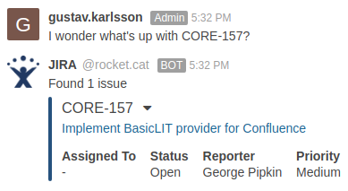

# rocketchat-jira-trigger

[](https://travis-ci.org/gustavkarlsson/rocketchat-jira-trigger)
[](https://codecov.io/gh/gustavkarlsson/rocketchat-jira-trigger)
[](https://hub.docker.com/r/gustavkarlsson/rocketchat-jira-trigger)
[](https://microbadger.com/images/gustavkarlsson/rocketchat-jira-trigger)
[](https://microbadger.com/images/gustavkarlsson/rocketchat-jira-trigger)
[](https://github.com/gustavkarlsson/rocketchat-jira-trigger/blob/master/LICENSE)

Outgoing webhook integration for [Rocket.Chat](https://rocket.chat) that summarizes any [JIRA](https://www.atlassian.com/software/jira) issues mentioned



## Running

You can run rocketchat-jira-trigger either natively (requires at [JDK 8](http://www.oracle.com/technetwork/java/javase/downloads/index.html) to build and [JRE 8](http://www.oracle.com/technetwork/java/javase/downloads/index.html) to run) or with [Docker](https://www.docker.com).

### Natively

First download the [source code](https://github.com/gustavkarlsson/rocketchat-jira-trigger/releases) and run:

#### Build on Linux/OS X

```shell
./gradlew installDist
```

#### Build on Windows

```shell
gradlew.bat installDist
```

The app will be located in `build/install`. Now run the start script with a configuration file (if you have one) as the only argument:

#### Run on Linux/OS X

```shell
bin/rocketchat-jira-trigger config.toml
```

#### Run on Windows

```shell
bin\rocketchat-jira-trigger.bat config.toml
```

### With Docker

Use the Docker cli to mount a config file (if you have one) as volume `/app/config.toml` and set up port mapping for port `4567`:

```shell
docker run -v $(pwd)/config.toml:/app/config.toml -p 4567:4567 --rm -it gustavkarlsson/rocketchat-jira-trigger:latest
```

## Configuration

To get started you only need to configure the URI of your JIRA server and some user credentials (unless anonymous access is allowed). There are two ways to configure the application:

### Configuration file

Create a file with the `.toml` extension and set it up like this:

```toml
[jira]
uri = "https://jira.mycompany.com"
username = "jira-registered@email.com"
password = "API_TOKEN"
```

Since mid 2019, Jira requieres e-mail and [API_TOKEN](https://confluence.atlassian.com/cloud/api-tokens-938839638.html) in order to access REST API services. 

### Environment variables

Environment variables should follow the pattern: `<section>_<key>`. Compare these examples with the above config file example to see the similarity:

#### Configuring environment variables on Linux/OS X

```shell
export jira_uri="https://jira.mycompany.com"
export jira_username="jira-registered@email.com"
export jira_password="API_TOKEN"
```

#### Configuring environment variables on Windows

```shell
setx jira_uri "https://jira.mycompany.com"
setx jira_username "jira-registered@email.com"
setx jira_password "API_TOKEN"
```

For lists of values, use a comma as a separator:

```text
assignee,status,reporter,priority
```

### Reference

For a list of all configuration settings, check out the [defaults](https://github.com/gustavkarlsson/rocketchat-jira-trigger/blob/master/src/main/resources/defaults.toml).

### Passwords

If you don't want to store your password in a file or environment variable, then leave it out and you will be prompted to enter it when running the app.

## Usage

In Rocket.Chat, set up an outgoing webhook pointing at the server on port `4567`. Example: `http://server.mycompany.com:4567/`
and write a message containing a known JIRA issue to try it out. Example: `Let's check out SUP-1234`

Rocket.Chat should reply with details about the JIRA issue.

## Troubleshooting

If your messages aren't getting any replies, first check the logs of Rocket.Chat and rocketchat-jira-trigger.

### HTTP 403 errors

If you're getting HTTP 403 errors, it might be because [CAPTCHA](https://en.wikipedia.org/wiki/CAPTCHA) is enabled on your JIRA server and it wants you to manually re-authenticate. In that case, log out of JIRA in your browser and then log in again.

If you're still having trouble, feel free to [create an issue](https://github.com/gustavkarlsson/rocketchat-jira-trigger/issues/new) explaining your problem.

### Connection refused when using Docker

When using Docker, you must NOT override the app port in the configuration file. The Docker image is configured to
only export export port `4567`. You can change what port the container should listen to with the `-p` option.
